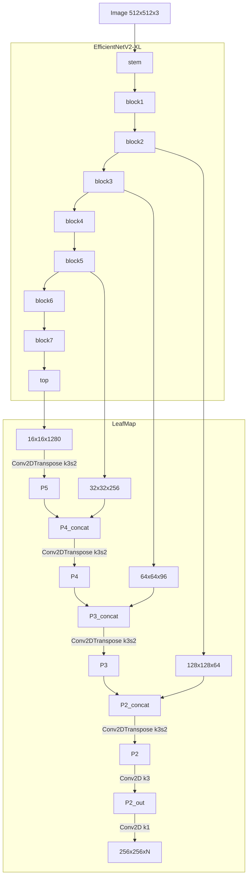
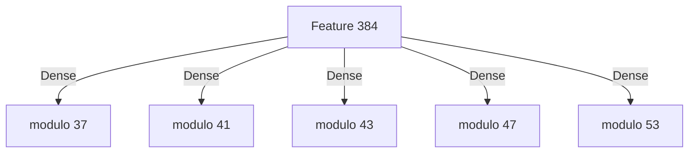

# findtextCenterNet
機械学習による日本語OCR

CenterNet　https://github.com/xingyizhou/CenterNet
の手法で、
Backbone networkに EfficientNetV2 https://github.com/google/automl/tree/master/efficientnetv2
を使用しています。

現在、OCRの前段まで完成しております。後段は、各文字の特徴量ベクトルを文として入力して、Transformerにより
文字コードとして文章を出力する予定です。

# Example
- 手書き文字


- フォント


# Details 

入力画像は 512x512x3

EfficientNetV2-XLの出力(入力の1/32サイズ)と、1/4,1/8,1/16サイズとなるのブロックからの途中出力を引き出し、strinde 2のConv2DTransposeで、最終的に
256x256xNの出力を得ます。



モデルの出力は、中心位置のヒートマップ(keyheatmap)x1、ボックスサイズ(sizes)x2、オフセット(offsets)x2、
文字の連続ライン(textline)x1、文字ブロックの分離線(sepatator)ｘ1の 256x256x7のマップと、
文字の384次元特徴ベクトル 256x256x384のマップが出力されます。

文字の特徴ベクトルの事前学習として、文字の特徴ベクトルを1文字ずつ文字コードに変換するモデルを後段に付けて学習を行います。



文字は、UTF32で1つのコードポイントとして表されるとして、37,41,43,47,53での剰余を学習させて、[Chinese remainder theorem](https://ja.wikipedia.org/wiki/%E4%B8%AD%E5%9B%BD%E3%81%AE%E5%89%B0%E4%BD%99%E5%AE%9A%E7%90%86)
により算出した値のうち、0x10FFFFより小さいものが得られた場合に有効としています。

最終的には、この後段は使用せず、文字の特徴ベクトルの連続をTransformerに入力して、文字コードの列を得る予定です。

# Prepare 
Python3でtensorflowを使用します。
学習の際に、horovodを使用しています。

```bash
pip3 install tensorflow
pip3 install tqdm
pip3 install matplotlib
pip3 install scikit-image
HOROVOD_WITH_TENSORFLOW=1 HOROVOD_GPU_OPERATIONS=NCCL HOROVOD_WITHOUT_GLOO=1 pip3 install --no-cache-dir horovod
```

データフォルダにある、make_kanji_list.shを事前に1回実行して、文字リストファイルを作成する必要があります。

```bash
cd data
./make_kanji_list.sh
```

学習時に使用するload_fontをコンパイルするのに、libfreetype6-devが必要です

```bash
sudo apt install libfreetype6-dev
```

学習前に、load_fontをコンパイルしておく必要があります。
```bash
cd data/load_font
make
```

学習には、フォントデータが必要です。
resource_list.txtを参照して、適宜フォントデータを配置してください。
著作権法30条の4の規定により、機械学習の学習を目的とする場合はデータをお渡しすることができます。
筆者と同じデータで学習を希望する方は、[メール](<mailto:contact@lithium03.info>)を送ってください。

# Train
horovodで8並列のA100で学習するのがよさげでした。もっとバッチサイズを小さくしても学習できると思いますが、あまり小さくすると上手くいかないことがあります。
efficientnetv2の学習済みの重みからスタートして、GCEのGPU8並列で、1日から2日回すと十分学習できると思われます。

```bash
wget https://storage.googleapis.com/cloud-tpu-checkpoints/efficientnet/v2/efficientnetv2-xl-21k-ft1k.tgz
tar xvf efficientnetv2-xl-21k-ft1k.tgz
./run.sh
```

# Test
学習データを、result/step1/ もしくは pretrain/ に置いた状態で、
test_image.pyを実行すると推論できます。

```bash
./test_image.py img/test1.png
```

# Reference 
- Objects as Points
https://arxiv.org/abs/1904.07850
- EfficientNetV2
https://arxiv.org/abs/2104.00298
- PyTorchではじめるAI開発　(p.256-)
https://www.amazon.co.jp/dp/B096WWVFJN


