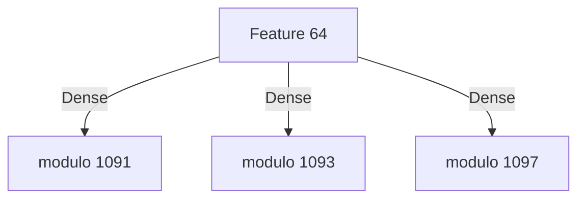
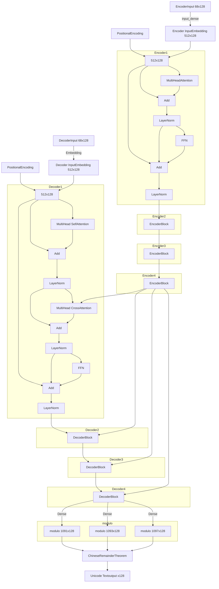

# findtextCenterNet
機械学習による日本語OCR

CenterNet　https://github.com/xingyizhou/CenterNet
の手法で、
Backbone networkに EfficientNetV2 https://github.com/google/automl/tree/master/efficientnetv2
を使用しています。

後段は、各文字の特徴量ベクトルを文として入力して、Transformerにより文字コードとして文章を出力します。

iOS/macOS アプリとしてこのモデルを使えるようにしたもの
https://apps.apple.com/us/app/bunkoocr/id1611405865

Windowsでこのモデルを使えるようにしたもの
https://lithium03.info/archives/bunkoOCR/bunkoOCR_20230910.zip

# Example
## 手書き文字


## フォント


# Details 
## detector(step1)

入力画像は 512x512x3

EfficientNetV2-XLの出力(入力の1/32サイズ)と、1/4,1/8,1/16サイズとなるのブロックからの途中出力を引き出し、UpSampling2Dで、最終的に
256x256xNの出力を得ます。


モデルの出力は、中心位置のヒートマップ(keyheatmap)x1、ボックスサイズ(sizes)x2、オフセット(offsets)x2、
文字の連続ライン(textline)x1、文字ブロックの分離線(separator)ｘ1、ルビである文字(code1_ruby)x1、
ルビの親文字(code2_rubybase)x1、圏点(code4_emphasis)x1、空白の次文字(code8_space)x1の 256x256x11のマップと、
文字の64次元特徴ベクトル 256x256x64のマップが出力されます。

文字の特徴ベクトルの事前学習として、文字の特徴ベクトルを1文字ずつ文字コードに変換するモデルを後段に付けて学習を行います。



文字は、UTF32で1つのコードポイントとして表されるとして、1091,1093,1097での剰余を学習させて、[Chinese remainder theorem](https://ja.wikipedia.org/wiki/%E4%B8%AD%E5%9B%BD%E3%81%AE%E5%89%B0%E4%BD%99%E5%AE%9A%E7%90%86)
により算出した値のうち、0x10FFFFより小さいものが得られた場合に有効としています。

最終的には、この後段は使用せず、文字の特徴ベクトルの連続をTransformerに入力して、文字コードの列を得る予定です。

## result image

例に挙げた画像では、モデルの出力は以下のようになります。

| 項目 | image |
| --- | ------ |
| 元画像 |  |
| 中心位置のヒートマップ(keyheatmap) |  |
| 文字の連続ライン(textline) |  |
| 文字ブロックの分離線(separator) |  |
| 空白の次文字(code8_space) |  |

中心位置のヒートマップ(keyheatmap)のピーク位置から、文字位置を特定します。文字位置のボックスを、文字の連続ライン(textline)に沿って並べて、文字列の並びを得ます。
このとき、文字ブロックの分離線(separator)で認識したブロック境界を越えないように文章列を分離します。

また、この例では空白の次文字(code8_space)のみが検出されていますが、ふりがな、ふりがなの親文字についても同様に検出し、マークしておき、後段のTransformerに入れるときに
追加して入れます。

## transformer(step2)

step1により、入力画像は、64次元特徴ベクトルの列に変換されます。
各文字には、空白の次の文字であるかのフラグ、ふりがなであるかどうかのフラグ、ふりがなの親文字であるかのフラグ、改行フラグの4次元を付加します。
こうして得られた68次元のベクトル列を、Transformerにより文字コードに変換します。

Transformerのエンコーダは最大128文字、デコーダーは最大128文字としました。
Encoder、Decoder共に、hidden_dim=512, head_num=16, hopping_num=4とし、PositionalEncodingはランダム初期化の学習ありです。
Decoderの出力は、1091,1093,1097での剰余により符号化します。



Decoderは、SOT=1で開始し、EOT=2で終了するまでの数値をUnicodeコードポイントとして学習させます。


# Prepare
Python3でtensorflowを使用します。

```bash
pip3 istall tensorflow
pip3 install matplotlib
pip3 install scikit-image
```

学習データを作成するのに使用する、render_fontをコンパイルするのに、libfreetype6-devが必要です

```bash
sudo apt install libfreetype6-dev
```

学習データを作成する前に、render_fontをコンパイルしておく必要があります。
```bash
make -C render_font
```

後段のTransformerに入れるために、検出した文字ボックスを整列させる必要があります。
このためのプログラムlinedetectはcppで記述しています。
```bash
make -C textline_detect
```

Windowsの場合は、Makefile.makを使用してください。
```cmd
cd textline_detect
nmake -f Makefile.mak
```

# Make train dataset for step1
学習用データセットは、https://bucket.lithium03.info/dataset20230627/train_data1/ 以下にあります。
ダウンロードするに次のようにします。
```bash
mkdir train_data1 && cd train_data1
curl -O "https://bucket.lithium03.info/dataset20230627/train_data1/test0000000[0-4].tfrecords"
curl -O "https://bucket.lithium03.info/dataset20230627/train_data1/train00000[000-299].tfrecords"
```

自身で学習データを作成するには、フォントデータが必要です。
resource_list.txtを参照して、適宜フォントデータを配置してください。
著作権法30条の4の規定により、機械学習の学習を目的とする場合はこれらのデータをお渡しすることができます。
希望する方は、[メール](<mailto:contact@lithium03.info>)を送ってください。

以下のコマンドで、train_data1 フォルダに学習用データセットを準備します。
```bash
./make_traindata1.py　5 300
```
この例では、test=5, train=300ファイルを作成します。

# Train for step1
```bash
./train1.py
```

step1の学習時に、回転や拡大縮小を行う処理を高速化するカスタムpipパッケージを入れると速くなります。
rotate_opフォルダ以下にソースがあります。dockerフォルダにあるイメージスクリプトで作成したイメージ上で
コンパイルしてください。

# Test for step1
学習済みパラメータを、ckpt1/　に置いた状態で、
test_image1.pyを実行すると推論できます。

```bash
./test_image1.py img/test1.png
```

# Make train dataset for step2
step1の文字検出器が学習できたら、後段のTransformerの学習データを作成します。

## 文字特徴量のサンプリング
make_chardata.pyを用いて、文字の画像データから、文字検出器が出力する各文字ごとの特徴量を収集します。
```bash
./make_chardata.py
```

chardata_fontフォルダ以下に、各文字の文字コードごとにファイルができます。
次に、1つのファイルにまとめます。

convert_chardata.pyを用いて、charparam.npzを生成します。
```bash
./convert_chardata.py
```

事前学習のckpt1のパラメータを使って作成した文字特徴量charparam.npzは、以下からダウンロード可能です。
https://bucket.lithium03.info/dataset20230807/charparam.npz

## step2の学習データtrain_data2の作成
最後に、make_traindata2.pyを実行して、ランダムな文字列、日本語および英語の文章(wikipediaおよび青空文庫)から
Transformer用の学習データをtrain_data2　フォルダに作成します。
```bash
./make_traindata2.py　10 200
```
この例では、test=10, train=200ファイルを作成します。

事前学習のckpt1のパラメータを使って作成した学習用データセットは、https://bucket.lithium03.info/dataset20230807/train_data2/ 以下にあります。
ダウンロードするには次のようにします。
```bash
mkdir train_data2 && cd train_data2
curl -O "https://bucket.lithium03.info/dataset20230807/train_data2/test0000000[0-9].tfrecords"
curl -O "https://bucket.lithium03.info/dataset20230807/train_data2/train00000[000-199].tfrecords"
```

# Train for step2
```bash
./train2.py
```

# Test for step2
学習済みパラメータを、ckpt1/　, ckpt2/に置いた状態で、
test_image2.pyを実行すると推論できます。

```bash
./test_image2.py img/test1.png
```

# Reference 
- Objects as Points
https://arxiv.org/abs/1904.07850
- EfficientNetV2
https://arxiv.org/abs/2104.00298
- PyTorchではじめるAI開発　(p.256-)
https://www.amazon.co.jp/dp/B096WWVFJN
- B2T Connection: Serving Stability and Performance in Deep Transformers
https://arxiv.org/abs/2206.00330


