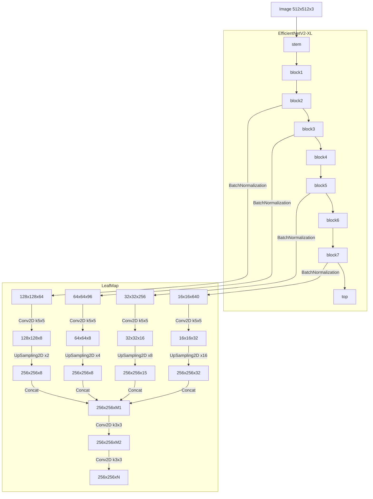
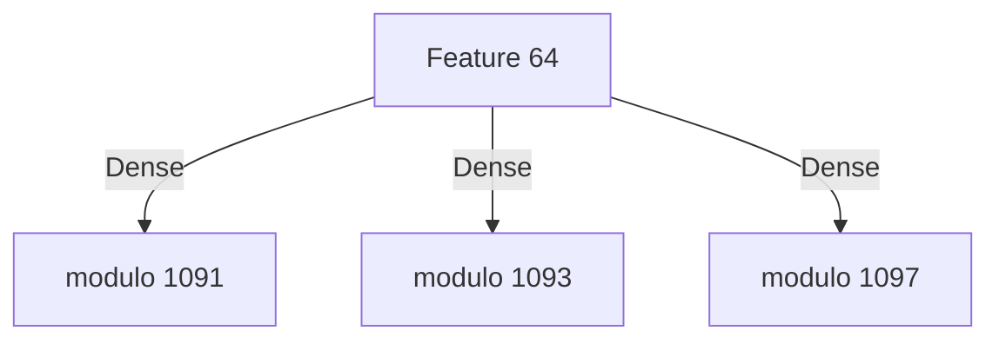

# findtextCenterNet
機械学習による日本語OCR

CenterNet　https://github.com/xingyizhou/CenterNet
の手法で、
Backbone networkに EfficientNetV2 https://github.com/google/automl/tree/master/efficientnetv2
を使用しています。

現在、OCRの前段まで完成しております。後段は、各文字の特徴量ベクトルを文として入力して、Transformerにより
文字コードとして文章を出力する予定です。

# Example
## 手書き文字


## フォント


# Details 

入力画像は 512x512x3

EfficientNetV2-XLの出力(入力の1/32サイズ)と、1/4,1/8,1/16サイズとなるのブロックからの途中出力を引き出し、UpSampling2Dで、最終的に
256x256xNの出力を得ます。



モデルの出力は、中心位置のヒートマップ(keyheatmap)x1、ボックスサイズ(sizes)x2、オフセット(offsets)x2、
文字の連続ライン(textline)x1、文字ブロックの分離線(sepatator)ｘ1、ルビである文字(code1_ruby)x1、
ルビの親文字(code2_rubybase)x1、圏点(code4_emphasis)x1、空白の次文字(code8_space)x1の 256x256x11のマップと、
文字の64次元特徴ベクトル 256x256x64のマップが出力されます。

文字の特徴ベクトルの事前学習として、文字の特徴ベクトルを1文字ずつ文字コードに変換するモデルを後段に付けて学習を行います。



文字は、UTF32で1つのコードポイントとして表されるとして、1091,1093,1097での剰余を学習させて、[Chinese remainder theorem](https://ja.wikipedia.org/wiki/%E4%B8%AD%E5%9B%BD%E3%81%AE%E5%89%B0%E4%BD%99%E5%AE%9A%E7%90%86)
により算出した値のうち、0x10FFFFより小さいものが得られた場合に有効としています。

最終的には、この後段は使用せず、文字の特徴ベクトルの連続をTransformerに入力して、文字コードの列を得る予定です。

# Prepare 
Python3でtensorflowを使用します。

```bash
pip3 install tensorflow
pip3 install matplotlib
pip3 install scikit-image
```

学習データを作成するのに使用する、render_fontをコンパイルするのに、libfreetype6-devが必要です

```bash
sudo apt install libfreetype6-dev
```

学習データを作成する前に、load_fontをコンパイルしておく必要があります。
```bash
make -C render_font
```

# Make train dataset
学習用データセットは、https://bucket.lithium03.info/dataset20230627/train_data1/ 以下にあります。
ダウンロードするには以下のようにします。
```bash
mkdir train_data1 && cd train_data1
curl -O "https://bucket.lithium03.info/dataset20230627/train_data1/test0000000[0-4].tfrecords"
curl -O "https://bucket.lithium03.info/dataset20230627/train_data1/train00000[000-299].tfrecords"
```

自身で学習データを作成するには、フォントデータが必要です。
resource_list.txtを参照して、適宜フォントデータを配置してください。
著作権法30条の4の規定により、機械学習の学習を目的とする場合はこれらのデータをお渡しすることができます。
希望する方は、[メール](<mailto:contact@lithium03.info>)を送ってください。

以下のコマンドで、train_data1 フォルダに学習用データセットを準備します。
```bash
./make_traindata1.py　5 300
```
この例では、test=5, train=300ファイルを作成します。

# Train
```bash
./train1.py
```

# Test
学習データを、ckpt1/　に置いた状態で、
test_image1.pyを実行すると推論できます。

```bash
./test_image1.py img/test1.png
```

# Reference 
- Objects as Points
https://arxiv.org/abs/1904.07850
- EfficientNetV2
https://arxiv.org/abs/2104.00298
- PyTorchではじめるAI開発　(p.256-)
https://www.amazon.co.jp/dp/B096WWVFJN


